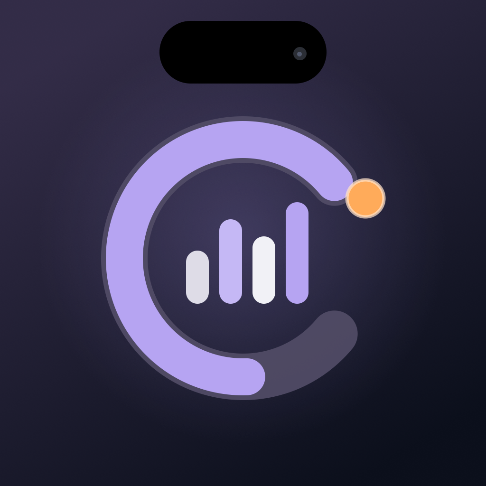
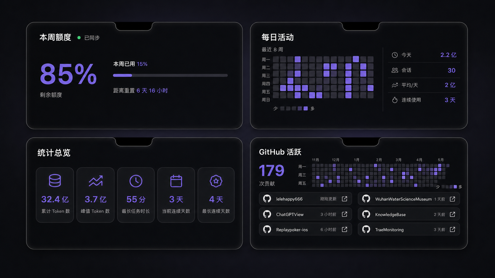

<p align="center">
  
</p>

<h1 align="center">Codex Monitor</h1>

<p align="center">
  <strong>一眼掌握 Codex 额度、活动与项目状态</strong>
</p>

<p align="center">
  一款原生 macOS 菜单栏应用。它把分散在本机 Codex 会话中的额度、Token、活跃趋势和项目状态，
  整理成一个安静、紧凑、随时可见的数据面板。
</p>

<p align="center">
  <code>macOS 14+</code>&nbsp;&nbsp;
  <code>Swift 6</code>&nbsp;&nbsp;
  <code>v0.1.20</code>&nbsp;&nbsp;
  <code>Windows 11</code>
</p>

<br>

<p align="center">
  
</p>

<p align="center">
  <sub>macOS 刘海面板 · 周额度 / 每日活动 / 统计总览 / GitHub 活跃</sub>
</p>

---

## 为什么是 Codex Monitor

Codex Monitor 常驻菜单栏，不需要打开额外窗口，也不会打断当前工作。鼠标移到顶部入口即可展开完整数据面板，移开后自动收起。

- **原生而轻量**：macOS 版本使用 SwiftUI 与 AppKit，不依赖浏览器运行时。
- **数据一屏看完**：额度、活动、项目、统计与 GitHub 信息集中在一个紧凑面板中。
- **实时但不打扰**：会话文件变化后自动刷新，数字与进度条使用克制的滚动动画。
- **本地优先**：Codex 使用数据来自本机 `~/.codex/sessions`，没有可靠数据时不会估算。

## 核心能力

| 能力 | 你可以看到什么 |
| --- | --- |
| **本周额度** | 剩余额度、本周已用比例、距离重置时间，以及手动刷新状态 |
| **每日活动** | 今日 Token、会话数、日均 Token、连续使用天数与活动热力图 |
| **项目分析** | 最近 7 天、30 天和全部历史范围的项目 Token 分布与排名 |
| **统计总览** | 累计 Token、峰值 Token、最长任务时长、当前与最长连续天数 |
| **GitHub 活跃** | 最近 12 个月贡献热力图，以及最近更新的 6 个仓库快捷入口 |
| **完成通知** | 精确识别顶层 Codex 会话的真实完成状态并发送 macOS 系统通知 |

### 细节也会动

面板每次打开时，实时数字会从 `0` 平滑滚动到当前值，额度进度条同步增长。刷新数据后，项目排行、统计数字和额度比例会自然过渡到新结果；关闭面板后动画立即停止并归零，为下一次展示做好准备。

系统启用“减少动态效果”时，应用会直接显示最终数据。

## GitHub 活跃

GitHub 功能在未绑定时显示清晰的授权提示；绑定后展示贡献热力图、总贡献次数和最近更新的仓库。

<p align="center">
  
</p>

<p align="center">
  <sub>GitHub 未绑定 / 已授权 · 界面设计预览</sub>
</p>

GitHub 绑定由用户主动触发，凭据保存在 macOS 系统钥匙串中。应用仅在绑定和刷新 GitHub 活跃数据时访问 GitHub 服务。

## 快速开始

### 环境要求

- macOS 14 或更高版本
- Xcode 与 Swift 6 工具链
- 本机至少运行过一次 Codex，并已生成 `~/.codex/sessions`

### 从源码构建

```bash
git clone https://github.com/lelehappy666/ChatGPTView.git
cd ChatGPTView

swift test
bash scripts/package-app.sh
open "dist/Codex Monitor.app"
```

打包完成后，应用位于：

```text
dist/Codex Monitor.app
```

> 首次打开后，Codex Monitor 会常驻菜单栏。GitHub 活跃为可选功能，可在面板内按提示绑定。

## 工作方式与隐私

Codex Monitor 默认读取：

```text
~/.codex/sessions
```

应用在本机解析会话记录，并生成额度、Token、每日活动、项目分析和统计数据。

| 数据 | 处理方式 |
| --- | --- |
| Codex 会话与用量 | 从本机 `.codex/sessions` 读取并在本地聚合 |
| 周额度 | 使用会话中可验证的 Codex 周窗口；无法可靠取得时显示不可用 |
| GitHub 凭据 | 保存到 macOS 系统钥匙串 |
| GitHub 活跃 | 仅在用户绑定后通过 GitHub 接口刷新 |
| 完成通知 | 根据真实会话、轮次和完成状态在本机判断 |

## Windows 11

仓库同时包含 Windows 11 版本。它使用 .NET 8 与 Windows Forms，提供顶部紧凑胶囊、周额度、每日活动、项目分析、统计总览、系统托盘、完成通知和开机启动。

Windows 版本可打包为自包含的单文件应用，目标电脑不需要额外安装 .NET 运行时。

[查看 Windows 11 完整使用与打包说明 →](Windows/README.md)

## 技术栈

### macOS

- Swift 6
- SwiftUI + AppKit
- Swift Package Manager
- XCTest
- GitHub GraphQL API
- macOS Keychain

### Windows

- .NET 8
- Windows Forms
- Windows 11 原生通知与系统托盘
- 无第三方 NuGet UI 依赖

## 项目结构

```text
.
├── Sources/CodexMonitor/       # macOS 应用源码
│   ├── App/                    # 生命周期与应用入口
│   ├── Data/                   # 会话扫描、聚合与刷新
│   ├── Domain/                 # 领域模型
│   ├── GitHub/                 # GitHub 授权与活跃数据
│   ├── MenuBar/                # 菜单栏与统一下拉面板
│   ├── Notch/                  # 刘海分页面板
│   └── Notifications/          # 会话完成通知
├── Tests/CodexMonitorTests/    # macOS 自动化测试
├── Resources/                  # 图标与应用配置
├── Windows/                    # Windows 11 版本
├── docs/designs/               # 界面设计预览
└── scripts/                    # macOS 打包与签名脚本
```

## 开发与验证

运行 macOS 完整测试：

```bash
swift test
```

生成生产应用包：

```bash
bash scripts/package-app.sh
```

Windows 版本可在 Windows 11 中从仓库根目录运行：

```text
build-win11.bat
```

## 问题反馈

如果遇到数据显示、通知、GitHub 绑定或界面适配问题，欢迎在
[GitHub Issues](https://github.com/lelehappy666/ChatGPTView/issues) 中提交反馈。

提交问题时建议附上：

- macOS 或 Windows 版本
- Codex Monitor 版本
- 问题发生的页面
- 可复现步骤和截图

## 许可证

本仓库当前尚未声明开源许可证。许可证信息将在仓库中另行说明。
