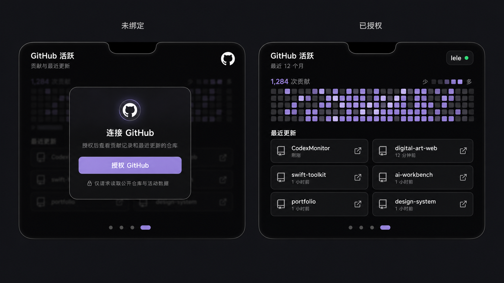

# macOS GitHub 活跃页设计

## 目标

在现有 macOS 刘海面板中增加第 4 个横向滑动页面，用于展示 GitHub 个人贡献和最近更新的仓库。用户未绑定 GitHub 时先看到授权提示，授权完成后才加载个人数据。

设计稿：

## 页面位置与视觉延续

- 页面作为 `NotchDashboardView` 的第 4 页，与周额度、每日活动、统计总览使用同一套横向滑动导航。
- 面板继续使用黑色背景、底部 24 点圆角、白色主文字、灰色次文字和淡紫色强调色。
- 底部分页指示器增加到 4 个；进入 GitHub 页时，第 4 个指示器显示为淡紫色胶囊。
- 页面保持现有刘海面板尺寸，不新增侧栏、浏览器外框或独立窗口。

## 未绑定状态

页面背景保留贡献热力图和仓库卡片的弱化轮廓，并使用遮罩降低对比度。中央显示紧凑的授权弹窗：

- 标题：`连接 GitHub`
- 说明：`授权后查看贡献记录和最近更新的仓库`
- 主按钮：`授权 GitHub`
- 隐私提示：`仅请求读取公开仓库与活动数据`

点击主按钮后进入 GitHub 授权流程。授权成功后关闭弹窗并刷新本页；用户取消授权或授权失败时仍停留在未绑定状态，并在弹窗中提供简短、可重试的错误提示。

## 已授权状态

### 页头

- 左侧显示标题 `GitHub 活跃` 和副标题 `最近 12 个月`。
- 右侧显示 GitHub 用户名和绿色连接状态点。

### 贡献区域

- 展示最近 12 个月的 GitHub 风格贡献热力图。
- 色阶使用深灰至 4 级淡紫色，不改用 GitHub 绿色，以保持产品视觉一致性。
- 同时展示贡献总数，以及“少—多”色阶图例。
- 鼠标悬停单元格时显示日期和当日贡献数。

### 最近更新仓库

- 展示最近有推送活动的前 6 个仓库。
- 默认按 GitHub 返回的 `pushed_at` 从新到旧排序，不引入额外活跃度评分。
- 仓库以两列三行的紧凑卡片排列。
- 每张卡片包含仓库名称、相对更新时间和外链图标。
- 点击整张卡片或外链图标，都使用系统默认浏览器打开仓库链接。
- 仓库名称过长时单行截断，但保留完整链接作为点击目标和辅助提示。

## 数据与状态流

1. 进入第 4 页时读取本地 GitHub 授权状态。
2. 未授权时只显示授权弹窗，不请求个人贡献或仓库数据。
3. 授权成功后并行请求贡献数据与仓库数据。
4. 仓库列表过滤无有效网页地址的项目，再按 `pushed_at` 降序取前 6 项。
5. 成功数据写入本地短期缓存，后续进入页面时先显示缓存，再在后台刷新。
6. 用户取消绑定后清除令牌、用户名、贡献数据和仓库缓存，页面立即回到未绑定状态。

## 异常与空状态

- 网络错误：保留最近一次缓存，并显示轻量的刷新失败提示；没有缓存时显示重试按钮。
- 授权失效：清除失效令牌并回到未绑定状态，提示用户重新授权。
- 没有公开仓库：贡献区域正常显示，仓库区域显示 `暂无最近更新的公开仓库`。
- 贡献数据为空：热力图显示为最低色阶，贡献总数显示为 0。
- 数据加载中：热力图和仓库卡片使用低对比度骨架占位，避免页面尺寸跳动。

## 组件边界

- `GitHubActivityPage`：组合页面并协调授权、加载、空状态和错误状态。
- `GitHubAuthorizationCard`：只负责未绑定提示和发起授权。
- `GitHubContributionHeatmap`：只负责贡献网格、色阶和悬停提示。
- `RecentRepositoryGrid`：负责排序后仓库集合的两列布局。
- `RepositoryLinkCard`：展示单个仓库并打开外链。
- `GitHubService`：封装授权状态、贡献和仓库数据请求，不直接依赖 SwiftUI。
- `GitHubCache`：保存可安全缓存的展示数据；访问令牌存入 macOS Keychain，不写入普通偏好设置或日志。

## 验收标准

- 横向滑动可进入第 4 页，分页指示器数量和选中状态正确。
- 未绑定时不会展示真实 GitHub 数据，且授权入口清晰可见。
- 授权后能看到最近 12 个月贡献热力图和最多 6 个最近推送的仓库。
- 6 个仓库按最近推送时间排序，点击后能在默认浏览器打开正确链接。
- 加载、空数据、网络错误、授权取消和授权失效均有稳定状态，页面尺寸不跳动。
- 访问令牌仅保存在 Keychain，日志和界面中不泄露令牌。
- 动效遵循系统“减少动态效果”设置。

## 本期不包含

- 私有仓库读权限和组织仓库管理。
- Star、Fork、Issue 或 Pull Request 排名。
- 自定义仓库置顶、拖拽排序或复杂活跃度评分。
- Windows 版本的 GitHub 页面。
