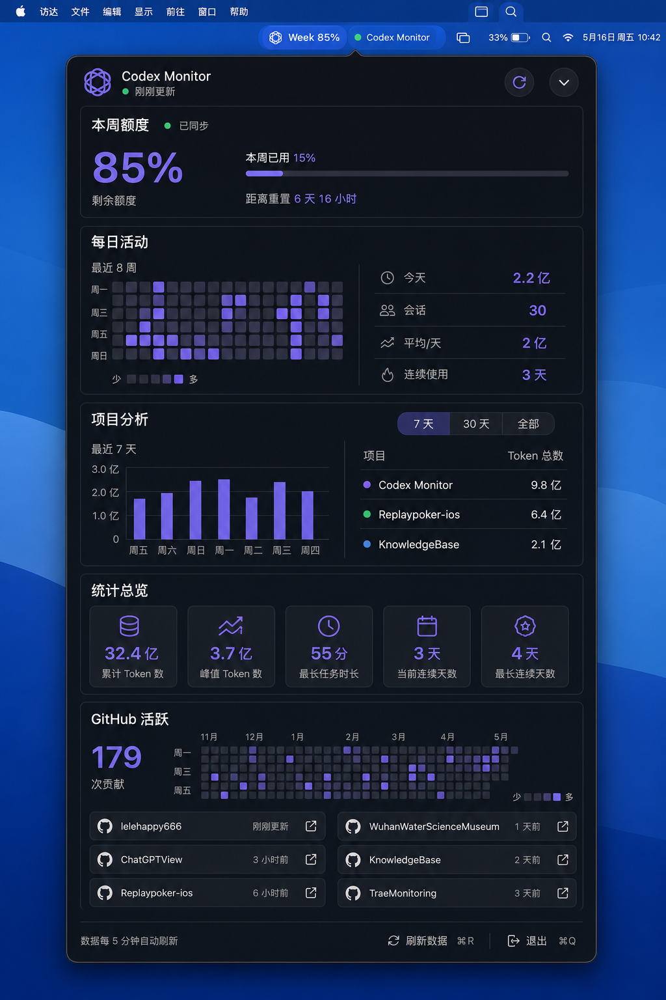

# macOS 菜单栏单页下拉面板设计

## 目标

将当前菜单栏的原生文字菜单替换为 Codex Monitor 自有的下拉面板，并把刘海窗口中的五个数据页面整合为一个连续的单页总览。

用户点击菜单栏中的 Codex Monitor 状态区域后，应当一次看到全部核心数据，不再通过左右滑动、分页圆点或侧边导航切换页面。

设计稿：

## 已确认的产品决策

- 面板采用单页纵向布局。
- 五个模块按照“本周额度、每日活动、项目分析、统计总览、GitHub 活跃”的顺序排列。
- 面板可以较长；在屏幕高度足够时完整展开。
- 在较小屏幕上，仍保持一个逻辑页面，仅使用纵向滚动作为适配手段。
- 不保留左右滑动、分页圆点、顶部标签或侧边页面导航。
- 菜单栏状态文字和项目轮播继续保留。
- 原刘海悬浮窗口停止启动，避免同一数据同时出现两套入口。

## 方案比较

### 方案一：`NSPopover` 承载 SwiftUI 单页总览（采用）

优点：

- 与 macOS 菜单栏的交互习惯一致，面板能够准确锚定菜单栏状态项。
- 系统负责点击外部关闭、窗口层级和多桌面行为。
- SwiftUI 内容可以直接订阅现有 `MonitorStore`。
- 改动集中在菜单栏控制器和新增面板视图，风险较低。

限制：

- 面板高度不能超过当前屏幕可用高度，需要在小屏幕上使用纵向滚动。

### 方案二：自定义 `NSPanel`

优点是尺寸、动画和位置可以完全控制；缺点是需要自行处理点击外部关闭、焦点、多屏幕定位和全屏空间，维护成本更高。

### 方案三：在 `NSMenuItem` 中放置自定义视图

优点是继续使用现有菜单结构；缺点是复杂 SwiftUI 交互、滚动和异步内容在 `NSMenu` 中限制较多，不适合作为完整数据面板。

## 面板行为

### 打开与关闭

- 点击菜单栏状态区域切换面板显示状态。
- 面板使用 `NSPopover.Behavior.transient`，点击面板外部自动关闭。
- 再次点击菜单栏状态区域时主动关闭。
- 面板打开时立即请求一次本地数据刷新。
- 关闭面板不取消后台目录监听和自动刷新。

### 尺寸与屏幕适配

- 目标宽度约为 `720 pt`。
- 目标内容高度约为 `840 pt`。
- 实际高度取目标高度和当前屏幕可用高度减去安全边距后的较小值。
- 内容始终属于同一个 `ScrollView`；大屏幕下无需滚动即可看到全部模块，小屏幕下允许纵向滚动。
- 不使用横向滚动。

### 键盘与按钮

- 顶部刷新按钮和底部“刷新数据”执行相同的 `MonitorStore.requestRefresh()`。
- 刷新快捷键为 `⌘R`。
- 退出快捷键为 `⌘Q`。
- 项目分析中的“7 天”“30 天”“全部”使用完整胶囊按钮作为点击区域，而不是只让文字响应点击。

## 信息结构

### 顶部状态栏

- Codex Monitor 标志与名称。
- 最近更新时间或“刚刚更新”状态。
- 刷新状态：
  - 空闲时显示刷新图标。
  - 刷新中显示旋转进度。
  - 失败时使用红色状态提示，并允许再次点击。
- 右侧下箭头用于收起面板。

### 本周额度

- 大号剩余额度百分比。
- 本周已用百分比和横向进度条。
- 距离重置时间。
- 数据同步状态。

额度数据继续遵循现有的新鲜度策略；过期数据不能伪装成当前额度。

### 每日活动

- 左侧显示最近八周活动热力图和颜色图例。
- 鼠标悬停在格子上时显示对应日期和 Token 数。
- 右侧显示今日 Token、会话数、日均 Token 和连续使用天数。

### 项目分析

- 顶部提供“7 天”“30 天”“全部”时间范围。
- 左侧显示选定范围内的 Token 柱状图。
- 鼠标悬停柱子时显示日期和 Token 数。
- 右侧显示主要项目及 Token 总量。
- 保留现有项目名称规整、范围筛选和统计口径。

### 统计总览

以五个紧凑指标卡显示：

- 累计 Token 数。
- 峰值 Token 数。
- 最长任务时长。
- 当前连续天数。
- 最长连续天数。

### GitHub 活跃

- 已授权时显示贡献总数、贡献热力图和最近更新的六个仓库。
- 鼠标悬停贡献格子时显示日期和提交次数。
- 点击仓库行或外链图标打开对应 GitHub 地址。
- 未授权时在本模块内部显示紧凑授权卡，不遮挡其他四个模块。
- GitHub 数据只在面板首次打开或缓存需要更新时加载，避免拖慢面板出现速度。

### 底部操作栏

- 左侧显示自动刷新说明和最后更新时间。
- 右侧显示“刷新数据 ⌘R”和“退出 ⌘Q”。

## 视觉规范

- 使用深色半透明材质、细边框和柔和阴影，保持原有黑色、紫色、薄荷绿色视觉语言。
- 面板圆角约为 `20–24 pt`。
- 一级模块之间使用卡片或分隔线建立层级，不使用分页。
- 主要数字使用紫色，正常同步和运行状态使用薄荷绿色，错误使用红色。
- 保持紧凑但不拥挤；同类卡片的圆角、边距和文字基线一致。
- 遵循“减少动态效果”辅助功能设置，不依赖位移动画表达状态。

## 代码结构

### `MenuBarController`

- 移除对 `NSMenu` 的依赖。
- 持有一个 `NSPopover`。
- 将状态栏按钮动作改为切换面板。
- 负责根据当前屏幕计算面板高度。

### `MenuDashboardView`

新增单页 SwiftUI 根视图，职责包括：

- 订阅 `MonitorStore`。
- 组织顶部状态栏、五个数据模块和底部操作栏。
- 管理项目分析时间范围。
- 管理 GitHub 数据存储对象。
- 将刷新和退出动作传递给对应按钮。

### 模块视图

每个模块保持独立 SwiftUI 组件：

- `UnifiedWeeklyQuotaSection`
- `UnifiedDailyActivitySection`
- `UnifiedProjectAnalyticsSection`
- `UnifiedStatisticsSection`
- `UnifiedGitHubActivitySection`

现有页面中的数据格式化、热力图计算、GitHub 缓存和链接策略继续复用。旧页面只在确认无其他调用后删除，避免复制业务规则。

### `AppDelegate`

- 不再创建和启动 `NotchWindowController`。
- 应用退出时不再执行刘海窗口清理。
- 目录监听、通知、周期刷新和菜单栏控制器保持不变。

## 数据流

1. 应用启动并创建共享 `MonitorStore`。
2. `MenuBarController` 创建菜单栏状态项和下拉面板。
3. 用户点击状态项后显示 `MenuDashboardView`，同时请求本地数据刷新。
4. `MenuDashboardView` 从 `MonitorStore.snapshot` 获取额度、活动、项目和统计数据。
5. GitHub 模块独立使用现有缓存，必要时异步更新。
6. 数据发布后，仅更新发生变化的模块，不重建整个窗口控制器。

## 性能要求

- 点击菜单栏后应立即出现面板，不等待磁盘扫描或 GitHub 网络请求。
- 移除刘海页面切换动画、鼠标滚轮翻页捕获和页面 `.id` 重建。
- 热力图和项目图表只根据对应输入数据更新。
- GitHub 网络加载延后到面板已经显示之后。
- 自动刷新时不关闭面板、不改变滚动位置。

## 错误与空状态

- 本地数据为空时，各模块显示紧凑说明，不隐藏整个面板。
- 刷新失败时保留上一份有效数据，并在顶部提供重试。
- GitHub 未绑定或令牌失效只影响 GitHub 模块。
- 外部仓库链接无效时不执行打开操作。

## 验收标准

- 点击菜单栏状态区域显示自定义下拉面板，不再显示原生文字菜单。
- 五个模块存在于同一个连续页面中。
- 不存在左右滑动、分页圆点或页面切换控件。
- 原刘海窗口不再因鼠标移动而出现。
- “7 天”“30 天”“全部”的整个按钮区域都可点击。
- 热力图和柱状图保留鼠标悬停信息。
- 刷新、自动刷新、GitHub 授权和仓库链接功能继续可用。
- 面板在小屏幕上可以纵向滚动，且不会超出屏幕可用区域。
- 打开面板时不被 GitHub 请求阻塞。

